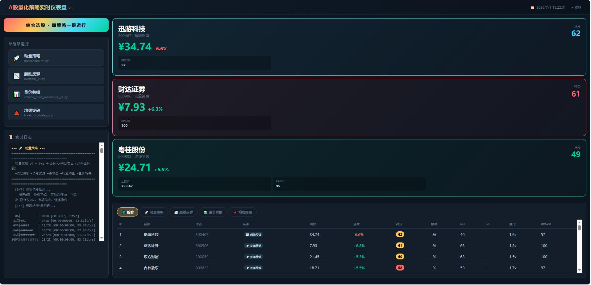

# 🐂 AI A-Stock 短线量化分析系统 V4

> ⚠️ **风险警示：本系统仅供技术学习与研究参考，不构成任何投资建议。股票投资有风险，入市需谨慎。历史回测与实时扫描数据不代表未来表现。使用者须自行承担全部交易风险。**

基于 Python 的 A 股 T+1 隔日交易选股系统。内置**四策略体系** + Web 可视化仪表盘 + 统一回测框架 + 全市场扫描 + 市场情绪检测 + 真实RPS + 基本面过滤。

---

## 📦 环境依赖

```bash
pip install pandas numpy stockstats mootdx requests
```

| 库 | 用途 |
|---|---|
| `mootdx` (tdxpy) | 通达信 TCP 行情数据（实时行情 + K线） |
| `stockstats` | 技术指标计算（RSI / MACD / KDJ / BOLL） |
| `pandas` | 数据处理 |
| `requests` | HTTP API（东财/腾讯/同花顺） |

---

## 🗂️ 项目结构

```
ai_a_stock/
├── strategies/                        # V4 策略（核心）
│   ├── momentum_v4.py                 # 动量策略：追今日涨幅3-7%的强势股
│   ├── oversold_v4.py                 # 超跌反弹：抄今日大跌2-8%的反弹
│   ├── volume_price_resonance_v4.py   # 量价共振：放量+主力流入+趋势三确认
│   └── breakout_strategy.py           # 均线突破：放量突破MA20/MA60启动信号
│
├── stock_utils.py                     # 公共模块（行情/指标/换手/资金/情绪/基本面/RPS）
│
├── backtest/
│   └── backtest_framework.py          # 统一回测框架（滚动窗口+胜率+盈亏比+IC分析）
│
├── tools/                             # 辅助工具
│   ├── draw_kline.py                  # K线图生成
│   ├── draw_kline_interactive.py      # 交互式K线图（Plotly）
│   ├── ths_hot.py                     # 同花顺当日强势股列表
│   ├── pick_stock.py                  # 今日强势股筛选
│   └── deep_compare.py                # 候选股深度对比分析
│
├── legacy/                            # V3 策略（参考保留）
│   ├── momentum_v3.py
│   ├── oversold_v3.py
│   ├── enhanced_score.py
│   ├── score_stocks.py
│   └── backtest_score.py
│
├── .claude/skills/a-stock-data/       # Claude Code Skill
├── charts/                            # K线图输出
└── README.md
```

---

## 🚀 快速开始

### 动量策略 V4（追强势股）
```bash
python strategies/momentum_v4.py
```
- 全市场扫描今日涨幅 3-7% 的股票
- 13因子评分：均线排列 + RSI + MACD + 量能 + 真实RPS + 行业动量 + 基本面
- 市场情绪 Gate（炸板率>35% 直接退出）
- 输出 TOP15 + ATR止损 + 最终推荐

### 超跌反弹 V4（抄底）
```bash
python strategies/oversold_v4.py
```
- 全市场扫描今日跌幅 2-8% 的股票
- 11因子评分：超跌深度 + 下影线 + 均线支撑 + RSI超卖 + 低位放量
- 跌停>50家自动退出（恐慌不抄底）

### 量价共振 V4（三维确认）
```bash
python strategies/volume_price_resonance_v4.py
```
- 量价配合 + 主力资金流入 + 趋势向上 三重共振
- 高位放量危险检测（BOLL>85%+量比>1.5）

### 均线突破 V1（启动信号）
```bash
python strategies/breakout_strategy.py
```
- 放量突破 MA20/MA60 的启动信号捕捉
- 9因子评分：突破强度 + 量能确认 + 资金共振 + RPS

### 回测验证
```bash
python backtest/backtest_framework.py
```
- 滚动窗口回测 + 信号vs噪声对比 + 分数段细分 + Spearman秩相关

---

## 🌐 Web 可视化仪表盘

一键启动带实时进度动画的策略仪表盘，四策略并行 / 综合选股 / SSE 实时日志推流：

```bash
pip install flask
python web_dashboard.py
```

浏览器打开 `http://127.0.0.1:5000`



### 仪表盘功能

| 功能 | 说明 |
|------|------|
| **综合选股** | 一键顺序运行全部四个策略，自动去重合并，标注每只股票来源策略 |
| **单策略运行** | 独立运行动量/超跌/量价共振/均线突破，查看各策略专属结果 |
| **实时日志流** | SSE (Server-Sent Events) 实时推流策略 stdout，无需刷新页面 |
| **K线蜡烛动画** | 等待结果时展示动态 K 线图（蜡烛弹跳 + MA 均线描边 + 价格跳动 + 浮动粒子） |
| **进度条** | 四个策略独立彩色进度条，7 步进度精确反馈 |
| **推荐卡片** | 最终推荐股票独立卡片展示（现价/涨跌/目标价/止损/换手/RPS/PE） |
| **结果表格** | 完整的候选股排序表格（支持综合/各策略标签切换） |
| **深色主题** | 专业交易终端风格深色 UI，自适应布局 |

### 架构说明

- **单文件部署**：`web_dashboard.py` 包含 Flask 后端 + Jinja2 HTML 模板 + 前端 JS
- **子进程隔离**：每个策略在独立 Python 子进程中运行，`PYTHONIOENCODING=utf-8` 确保中文输出
- **通用解析器**：`parse_strategy_output` 正则解析所有四种策略的输出格式
- **综合选股流程**：顺序执行 → 去重合并 → 按评分排序 → 标注来源

---

## 🛡️ V4 核心能力

### 市场情绪 Gate（策略启动前检测）
| 指标 | 阈值 | 动作 |
|------|------|------|
| 炸板率 | > 35% | 动量/量价/突破 直接退出 |
| 跌停家数 | > 50 | 超跌策略退出 |
| 市场温度 | < 25 | 动量策略退出 |
| 涨停家数 | < 20 | 动量策略警告 |

### 基本面过滤（全策略通用）
| 条件 | 动作 |
|------|------|
| PE < 0 或 PE > 200 | 排除 |
| PB > 10 | 排除 |
| 市值 < 20亿 / < 30亿 | 排除 |

### 真实 RPS
- 基于全市场20日涨幅排名百分位
- RPS ≥ 85: +8分 | RPS < 30: -6分

### ATR 动态止损
- 止损距离 = 1.5 × ATR14，限幅 2%-5%

### 安全门
各策略最终推荐前通过多重安全检查（量比/RSI/乖离/连涨/连阴/上影线/RPS），不通过则拒绝推荐。

---

## 📊 V4 策略对比

| 策略 | 选股逻辑 | 评分因子 | 适合行情 |
|------|---------|---------|---------|
| 动量 V4 | 涨幅3-7%强势追涨 | 13因子 | 强势/偏强 |
| 超跌 V4 | 跌幅2-8%抄底反弹 | 11因子 | 震荡/偏弱 |
| 量价共振 V4 | 放量+主力流+趋势 | 10因子 | 偏强/震荡 |
| 均线突破 V1 | 突破MA20/MA60+放量 | 9因子 | 偏强 |

---

## 📝 数据源

| 数据 | 来源 |
|------|------|
| 实时行情 + K线 | 通达信（mootdx TCP） |
| 换手率 + 大单净量 + 量比 | 东方财富 push2his API |
| PE/PB/市值 | 东方财富 push2his API |
| 市场情绪（涨停/炸板） | 东方财富 clist API |
| 行业板块排名 | 东方财富 push2 API |
| 股票名称 | 腾讯行情 API |
| 强势股列表 | 同花顺接口 |

---

## 🚨 风险告知与免责声明（请务必阅读）

### 核心风险警示

> **本系统输出的任何选股结果、评分、推荐均不构成投资建议。使用者须独立判断，自负盈亏。**

| 风险类别 | 具体说明 |
|----------|----------|
| **市场风险** | 任何股票价格均可能大幅波动，存在本金全部损失的可能 |
| **模型风险** | 策略基于纯技术面因子，不含财报/政策/行业消息/主力意图等关键信息 |
| **回测误导** | 历史回测收益不代表未来表现，过去有效的因子可能在未来失效 |
| **数据延迟** | 实时行情存在秒级延迟，尤其是极端行情下数据可能不准确 |
| **API 不稳定** | 东方财富等第三方数据源可能出现拒绝连接或字段缺失，导致结果偏差 |
| **过拟合风险** | 多因子评分体系可能对历史数据过拟合，实战中表现可能低于预期 |
| **黑天鹅事件** | 策略无法预测突发利空（财务造假/监管处罚/地缘政治等） |
| **流动性风险** | 小市值个股可能出现流动性枯竭，导致无法按预期价格成交 |

### 免责声明

1. **本系统及相关代码（以下简称"本工具"）仅供技术学习与研究参考，严禁用于实盘交易决策。**
2. 本工具的开发者、贡献者、分发者**不承担**使用者因使用本工具而产生的任何直接或间接损失。
3. 股票/基金/衍生品投资存在高风险，**可能造成超过本金的损失**，入市前应充分了解相关风险。
4. 本工具的选股逻辑、评分算法、止损建议等**不能替代**持牌金融机构的专业投资建议。
5. 使用者应在**完全理解策略逻辑与局限**的前提下，结合自身风险承受能力独立作出投资决策。
6. 本工具不对数据的**准确性、完整性、及时性**做任何保证。
7. 过去的表现（包括回测结果）**绝不预示**未来收益。

> 🔴 **简而言之：本工具是学习量化编程的练手项目，不是帮你赚钱的工具。用它做交易，亏了别找我。**

---

## 📋 更新日志

### V4.1 — Web 仪表盘 + UI 增强
- 新增 Web 可视化仪表盘（Flask SSE 实时推流）
- 综合选股：一键运行四策略，自动去重合并
- K线蜡烛动画（动态蜡烛弹跳 + MA 均线描边 + 浮动粒子）
- 独立彩色进度条 + 实时日志流
- 推荐卡片 + 可切换标签结果表格
- 修复超跌/量价策略 `pb=0` 误过滤（API 数据不可用时跳过过滤）
- 修复解析器仅识别 `RSI14` 的 Bug（扩展至 RSI6/量比/换手等 12 关键词）
- 修复「今日跌幅」推荐解析缺失
- 深色主题 + SSE UTF-8 编码适配

### V4.0 — 全面升级
- 新增市场情绪 Gate（涨停/跌停/炸板率/市场温度）
- 新增真实 RPS（全市场排名百分位）
- 新增基本面过滤（PE/PB/市值）
- 新增行业动量排名
- 新增均线突破策略
- 新增统一回测框架
- 修复 get_extra_data_batch API（多页拉取+日缓存）
- 所有策略升级多因子评分体系
- 项目结构重组（strategies/core/backtest/tools/legacy）

### V3.0 — 策略升级
- 动量策略 V3 + 超跌策略 V3 + 量价共振策略
- stock_utils.py 公共模块（换手率/资金流向/技术指标/量价背离/ATR止损）
- 大盘环境检测（涨跌比统计）

### V2.0 — 安全版
- 安全惩罚系统 + 风险标签 + 安全门机制

### V1.0 — 初始版本
- 动量策略 + 超跌反弹 + 多因子评分 + K线可视化
