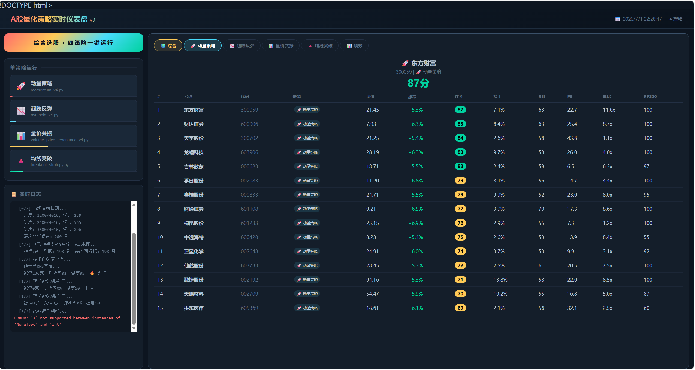

# AI A-Stock 短线量化分析系统 V4.3

> # ⛔ 严禁用于实盘交易 ⛔
>
> **本系统仅为量化编程技术学习与学术研究用途。任何基于本系统输出的选股结果、
> 评分、推荐进行的实盘交易行为，均与本项目无关。**
>
> **股市有风险，投资须谨慎。量化模型无法预测市场，历史回测不代表未来表现。
> 使用者如擅自将本工具用于实盘交易，须自行承担全部资金损失及法律后果。**

基于 Python 的 A 股 T+1 隔日交易选股系统。内置**四策略体系** + Web 可视化仪表盘 + 统一回测框架 + **策略进化引擎**（数据库记录、绩效追踪、因子IC分析、权重自动优化）。

---

## 环境依赖

```bash
pip install -r requirements.txt
```

| 库 | 用途 |
|---|---|
| `mootdx` | 通达信 TCP 行情数据（实时行情 + K线） |
| `stockstats` | 技术指标计算（RSI / MACD / KDJ / BOLL） |
| `flask` | Web 仪表盘后端 |
| `matplotlib` + `mplfinance` | K线快照图生成 |
| `pandas` / `numpy` | 数据处理与数值计算 |
| `scipy` | Spearman 秩相关 / 因子IC分析 |
| `requests` | HTTP API（东财/腾讯/同花顺） |

---

## 项目结构

```
ai_a_stock/
├── app.py                             # 主入口: python app.py
├── requirements.txt                   # 依赖清单
├── .env.example                       # 环境变量模板
├── .gitignore
├── README.md
│
├── core/                              # —— 核心库
│   ├── config.py                      #   配置中心（所有可调参数）
│   ├── logging_config.py              #   统一日志
│   ├── stock_utils.py                 #   行情 / 技术指标 / 资金 / 情绪 / RPS
│   ├── db_manager.py                  #   SQLite 数据库（选股入库 + 绩效 + 权重）
│   ├── performance_tracker.py         #   T+N 绩效追踪与统计
│   ├── strategy_optimizer.py          #   因子IC分析 + 权重自动优化
│   └── scheduler.py                   #   后台调度引擎（定时追踪 + 自动优化）
│
├── web/                               # —— Web 应用
│   ├── dashboard.py                   #   Flask 后端（SSE + API + K线图）
│   └── templates/
│       └── dashboard.html             #   仪表盘前端模板
│
├── strategies/                        # —— 四策略
│   ├── momentum_v4.py                 #   动量策略：追涨幅3-7%的强势股
│   ├── oversold_v4.py                 #   超跌反弹：抄跌幅2-8%的反弹
│   ├── volume_price_resonance_v4.py   #   量价共振：放量+主力流入+趋势确认
│   └── breakout_strategy.py           #   均线突破：放量突破MA20/MA60启动信号
│
├── backtest/                          # —— 回测框架
│   └── backtest_framework.py
│
├── tools/                             # —— 辅助工具
│   ├── draw_kline.py                  #   K线图生成
│   ├── draw_kline_interactive.py      #   交互式K线图（Plotly）
│   ├── ths_hot.py                     #   同花顺当日强势股列表
│   ├── pick_stock.py                  #   今日强势股筛选
│   └── deep_compare.py                #   候选股深度对比分析
│
├── legacy/                            # —— 历史版本（参考保留）
└── charts/                            # —— K线图输出
```

---

## 快速开始

### 一键启动 Web 仪表盘

```bash
pip install -r requirements.txt
python app.py
```

浏览器打开 `http://127.0.0.1:5000`



### 独立运行策略

```bash
python strategies/momentum_v4.py       # 动量策略
python strategies/oversold_v4.py       # 超跌反弹
python strategies/volume_price_resonance_v4.py  # 量价共振
python strategies/breakout_strategy.py # 均线突破
python backtest/backtest_framework.py  # 回测验证
```

---

## Web 仪表盘功能

| 功能 | 说明 |
|------|------|
| **综合选股** | 一键顺序运行四个策略，去重合并，标注来源 |
| **单策略运行** | 独立运行各策略，查看专属结果 |
| **实时日志流** | SSE 实时推流策略 stdout，无需刷新 |
| **K线蜡烛动画** | 等待时展示动态K线图（蜡烛弹跳 + MA描边 + 浮动粒子） |
| **K线快照弹窗** | 点击股票行弹出 60日K线 + MA均线 + 成交量 |
| **推荐卡片** | 最终推荐独立卡片（现价/目标/止损/换手/RPS/PE） |
| **结果表格** | 候选股排序表格 + 标签切换 + Hero区联动TOP1 |
| **绩效面板** | 各策略胜率/收益率/盈亏比 + 因子IC分析 + 最近表现 |
| **进化引擎** | 数据库自动记录 → 绩效追踪 → 因子分析 → 权重优化 |

---

## 策略进化引擎 (V4.3 新增)

### 工作流程

```
策略运行 → 结果自动入库 (SQLite)
       ↓
  Scheduler 每小时检测
       ↓
绩效追踪器 回查 T+1~T+5 实际收益率
       ↓
  积累 ≥30 条新数据 → 自动触发优化
       ↓
  IC分析 + 权重缩放 / 网格搜索 → 因子权重写入数据库
```

### 核心模块

| 模块 | 文件 | 职责 |
|------|------|------|
| 数据库 | `core/db_manager.py` | SQLite 4表：strategy_runs / stock_picks / pick_performance / factor_weights |
| 绩效追踪 | `core/performance_tracker.py` | 通过 mootdx 回查历史选股实际 T+N 表现 |
| 策略优化 | `core/strategy_optimizer.py` | Spearman 秩相关 IC 分析 + IC 缩放 + 网格搜索 |
| 后台调度 | `core/scheduler.py` | 每 60 分钟自动追踪绩效，积累数据后自动优化 |

---

## V4 核心能力

### 市场情绪 Gate（策略启动前检测）

| 指标 | 阈值 | 动作 |
|------|------|------|
| 炸板率 | > 35% | 动量/量价/突破 直接退出 |
| 跌停家数 | > 50 | 超跌策略退出 |
| 市场温度 | < 25 | 动量策略退出 |
| 涨停家数 | < 20 | 动量策略警告 |

### 基本面过滤（全策略通用）

| 条件 | 动作 |
|------|------|
| PE < 0 或 PE > 200 | 排除 |
| PB > 10 | 排除 |
| 市值 < 20亿 / < 30亿 | 排除 |

### 真实 RPS

- 基于全市场20日涨幅排名百分位
- RPS ≥ 85: +8分 | RPS < 30: -6分

### ATR 动态止损

- 止损距离 = 1.5 × ATR14，限幅 2%-5%

---

## 策略对比

| 策略 | 选股逻辑 | 评分因子 | 适合行情 |
|------|---------|---------|---------|
| 动量 V4 | 涨幅3-7%强势追涨 | 13因子 | 强势/偏强 |
| 超跌 V4 | 跌幅2-8%抄底反弹 | 11因子 | 震荡/偏弱 |
| 量价共振 V4 | 放量+主力流+趋势 | 10因子 | 偏强/震荡 |
| 均线突破 V1 | 突破MA20/MA60+放量 | 9因子 | 偏强 |

---

## 数据源

| 数据 | 来源 |
|------|------|
| 实时行情 + K线 | 通达信（mootdx TCP） |
| 换手率 + 大单净量 + 量比 | 东方财富 push2his API |
| PE/PB/市值 | 东方财富 push2his API |
| 市场情绪（涨停/炸板） | 东方财富 clist API |
| 行业板块排名 | 东方财富 push2 API |
| 股票名称 | 腾讯行情 API |
| 强势股列表 | 同花顺接口 |

---

## 配置管理

所有可调参数集中在 `core/config.py`：

- **服务器**: FLASK_HOST / FLASK_PORT
- **行情扫描**: QUOTE_BATCH_SIZE / 各策略筛选阈值
- **安全门**: SAFE_GATE 字典（四策略独立配置）
- **止损**: ATR_MULTIPLIER / ATR_STOP_MIN_PCT / ATR_STOP_MAX_PCT
- **调度**: SCHEDULER_CHECK_INTERVAL / OPTIMIZE_THRESHOLD
- **优化**: OPTIMIZE_MIN_SAMPLES / OPTIMIZE_LEARNING_RATE

支持通过 `.env` 文件或环境变量覆盖（参考 `.env.example`）。

---

## ⚠️ 风险告知与免责声明（具有法律约束力）

> # 禁止用于实盘交易
>
> 本项目（AI A-Stock 短线量化分析系统，以下简称"本工具"）是一款**技术学习与学术研究**用途的开源软件。
> **严禁**将本工具用于任何形式的实盘交易、投资决策或资金管理。

### 核心风险

| 风险类别 | 具体说明 |
|----------|----------|
| **市场风险** | 股票价格受宏观经济、政策变化、国际形势、公司经营等数百种因素影响，可能剧烈波动，存在本金全部损失甚至穿仓负资产的可能 |
| **模型风险** | 策略算法基于纯技术面因子（价格、成交量、技术指标），不包含财务报表分析、行业调研、政策研判、内幕消息等关键信息，存在严重信息不对称 |
| **过拟合风险** | 多因子评分体系的权重为人为设定或基于有限历史数据优化，对历史数据过拟合的可能性极高，未来实际表现可能与回测结果存在巨大偏差 |
| **数据风险** | 行情数据存在秒至分钟级延迟，极端行情下数据可能失真或中断；东方财富、通达信等第三方数据源随时可能变更接口、限制访问或停止服务 |
| **流动性风险** | 小市值、低换手率的个股可能存在流动性枯竭，导致无法以模型计算的价格成交，实际滑点远超模型预期 |
| **黑天鹅风险** | 策略无法预测财务造假、监管处罚、地缘冲突、突发公共卫生事件等极端情况，此类事件可导致持仓股票无量跌停、无法平仓 |
| **法律风险** | 在某些司法管辖区，使用算法进行自动化交易可能涉及合规审查、牌照要求等法律问题 |

### 免责条款

1. 本工具是一个**开源学习项目**，以"按原样（AS IS）"方式提供，不附带任何明示或默示的担保。
2. 本项目的开发者、贡献者和分发者**不承担**任何因使用或滥用本工具而产生的直接、间接、附带、特殊或结果性损失。
3. 使用者须在**完全理解策略逻辑、算法局限和金融风险**的前提下，将本工具**仅**用于学习和研究。
4. 本工具输出的任何选股结果、评分、推荐、止损价位**均不构成**投资建议、理财建议或交易信号。
5. 如果将本工具用于实盘交易所导致的任何资金损失，**责任完全由使用者自行承担**。

> **再次强调：本项目是学习量化编程的练手项目。如果用来做交易，亏损自负。**

---

## 更新日志

### V4.3 — 策略进化 + 工程化重构

- 新增 **策略进化引擎**：SQLite 数据库自动记录选股 → T+N 绩效追踪 → 因子 IC 分析 → 权重自动优化
- 新增 **绩效面板**：各策略胜率/收益率/盈亏比 + 因子 IC 分析柱状图 + 最近选股表现
- 新增 **后台调度器**：每 60 分钟自动追踪绩效，积累 30 条数据后自动触发优化
- 新增 **统一配置管理** `core/config.py`，所有可调参数集中维护
- 新增 **标准化日志** `core/logging_config.py`
- **项目结构重构**：`core/`（核心库）+ `web/`（Web应用）分层架构，HTML 模板独立
- 新增 `requirements.txt` / `.env.example` / `app.py` 统一入口

### V4.2 — K线快照 + 引擎优化

- 新增 K线快照弹窗（mplfinance 渲染 60日K线 + MA5/10/20 + 成交量）
- 策略引擎改为进程内线程执行（`exec()` + 守护线程）
- 修复量价共振 `upper_shadow` KeyError / 放宽 vr 阈值
- K线弹窗缓存 + CSS 过渡动画

### V4.1 — Web 仪表盘

- 新增 Web 可视化仪表盘（Flask SSE 实时推流）
- 综合选股 + K线蜡烛动画 + 进度条 + 推荐卡片

### V4.0 — 全面升级

- 市场情绪 Gate + 真实 RPS + 基本面过滤 + 行业动量 + 均线突破策略
